<div align="center">
  
</div>

[](https://crates.io/crates/tylax)
[](https://docs.rs/tylax)
[](LICENSE)
[](https://github.com/scipenai/tylax/actions/workflows/ci.yml)

> **Bidirectional, AST-based LaTeX ↔ Typst Converter**

Tylax is a high-performance tool written in Rust that converts **mathematical formulas, tables, full documents, and TikZ graphics** between LaTeX and Typst formats. It focuses on static analysis to preserve the document structure for manual editing and adjustment.

[English](README.md) | [中文](README_CN.md)

### 🔗 [Try Online Demo](https://convert.silkyai.cn)

---

## Installation

### From crates.io

```bash
cargo install tylax
```

### From Source

```bash
git clone https://github.com/scipenai/tylax.git
cd tylax
cargo build --release
```

---

## Usage

### Command Line Interface

```bash
# Basic conversion (auto-detect format)
t2l input.tex -o output.typ

# Convert math formula from stdin
echo '\frac{1}{2}' | t2l -d l2t

# Convert TikZ to CeTZ
t2l tikz input.tex -o output.typ
```

### Rust Library

Add to `Cargo.toml`:
```toml
[dependencies]
tylax = "0.1.0"
```

```rust
use tylax::{latex_to_typst, typst_to_latex};

fn main() {
    let typst = latex_to_typst(r"\frac{1}{2} + \alpha");
    println!("{}", typst); // Output: 1/2 + alpha
}
```

### WebAssembly

Tylax can be compiled to WASM for browser usage. See the [Online Demo](https://convert.silkyai.cn) for a live example. The online demo does not collect any user data.

```bash
# Build for web
wasm-pack build --target web --out-dir web/src/pkg --features wasm --no-default-features
```

---

## Design Philosophy

To build a handy tool specifically for LaTeX and Typst conversion scenarios.

*   **Goal**: Preserve the original source structure to make the output human-readable and easy to manually edit and adjust.
*   **Roadmap**: We are committed to maintaining this project, slowly but surely improving it. While currently static, we plan to explore adding limited dynamic evaluation in future versions.

### Architecture

```mermaid
%%{init: {'theme': 'base', 'themeVariables': { 'primaryColor': '#4a90d9', 'primaryTextColor': '#fff', 'primaryBorderColor': '#2d6cb5', 'lineColor': '#5c6bc0', 'secondaryColor': '#81c784', 'tertiaryColor': '#fff3e0'}}}%%

flowchart LR
    subgraph INPUT ["📄 Input"]
        direction TB
        LaTeX["LaTeX\n.tex"]
        Typst["Typst\n.typ"]
    end

    subgraph CORE ["⚙️ Core Engine"]
        direction TB
        
        subgraph L2T ["LaTeX → Typst"]
            direction LR
            MP[["🔍 MiTeX\nParser"]]
            LA[("AST")]
            LC{{"Converter"}}
            MP --> LA --> LC
        end
        
        subgraph T2L ["Typst → LaTeX"]
            direction LR
            TP[["🔍 typst-syntax\nParser"]]
            TA[("AST")]
            TC{{"Converter"}}
            TP --> TA --> TC
        end
        
        subgraph FEATURES ["📦 Features"]
            direction TB
            F1["Tables\n(Coverage Tracking)"]
            F2["TikZ/CeTZ\n(Coord Parser)"]
            F3["Macros\n(Recursive Expander)"]
            F4["References"]
        end
    end

    subgraph OUTPUT ["📄 Output"]
        direction TB
        TypstOut["Typst\n.typ"]
        LaTeXOut["LaTeX\n.tex"]
    end

    LaTeX --> MP
    LC --> TypstOut
    
    Typst --> TP
    TC --> LaTeXOut
    
    LC -.- FEATURES
    TC -.- FEATURES

    style INPUT fill:#e3f2fd,stroke:#1976d2,stroke-width:2px
    style CORE fill:#fff8e1,stroke:#ff8f00,stroke-width:2px
    style OUTPUT fill:#e8f5e9,stroke:#388e3c,stroke-width:2px
    style L2T fill:#e1f5fe,stroke:#0288d1
    style T2L fill:#fce4ec,stroke:#c2185b
    style FEATURES fill:#f3e5f5,stroke:#7b1fa2
    
    style MP fill:#bbdefb,stroke:#1976d2
    style TP fill:#f8bbd0,stroke:#c2185b
    style LA fill:#fff9c4,stroke:#fbc02d
    style TA fill:#fff9c4,stroke:#fbc02d
    style LC fill:#c8e6c9,stroke:#388e3c
    style TC fill:#c8e6c9,stroke:#388e3c
```



---

## Community

Join the conversation!

<div align="center">
  <a href="https://discord.gg/veKAFnDqsw" target="_blank"></a>
  &nbsp;
  <a href="https://qun.qq.com/universal-share/share?ac=1&authKey=3CYnFQ6qWEpRzP335ZvGXL7Hli1zMu5so7KKU41Hx8syPYxGJ8MiSA9nzBpBOAK0&busi_data=eyJncm91cENvZGUiOiIxMDU3MDc4ODEwIiwidG9rZW4iOiJpb3V0b0Z4QmQzdWdlUm9DUFRvcXFtT1VqblRFcmZzV1FLZXFqcktVeUJVemJobGZONlhoQ1dxU1NXN3J5NGNrIiwidWluIjoiMTMyNjYyNzY3NyJ9&data=jiifC7VOCQf-Ta1N2Y4K1Hzq4go_jsOBTcmA9vWKDZpe6nOubOeFASLyo2qwy1z_uJK1zi0QbjZAAnVgO8Ldjg&svctype=4&tempid=h5_group_info" target="_blank"></a>
</div>

---

## Contributing

Contributions are welcome! Please feel free to submit issues and pull requests.

1. Fork the repository
2. Create your feature branch (`git checkout -b feature/amazing-feature`)
3. Commit your changes (`git commit -m 'Add amazing feature'`)
4. Push to the branch (`git push origin feature/amazing-feature`)
5. Open a Pull Request

### Development Guidelines

- Follow Rust coding conventions
- Add tests for new features
- Update documentation as needed
- Run `cargo fmt` and `cargo clippy` before committing

### Corpus Regression Harness

Run the thesis corpus compile loop (convert → typst compile → report):

```bash
./tools/thesis_corpus_compile.sh
```

Notes:
- Report output: `target/thesis_corpus/compile_report.md` (logs per template under `target/thesis_corpus/<name>/`).
- Override corpus list with `THESIS_LIST=tools/thesis_corpus_list.txt`.
- Use prebuilt binaries via `T2L_BIN=target/debug/t2l` or `TYPST_BIN=/path/to/typst`.
- Skip templates with `THESIS_SKIP=mit-thesis,oxford-thesis`.
- Set compile timeout via `TYPST_TIMEOUT=120` (seconds). Uses `timeout`/`gtimeout` when available.

---

## License

This project is licensed under the Apache-2.0 License - see the [LICENSE](LICENSE) file for details.

## Acknowledgments

This project builds upon the following excellent projects:

- [MiTeX](https://github.com/mitex-rs/mitex) - High-performance LaTeX parser
- [tex2typst](https://github.com/qwinsi/tex2typst) - Symbol mapping reference
- [typst](https://github.com/typst/typst) - Official Typst syntax parser
- [Pandoc](https://github.com/jgm/pandoc) - Document structure conversion reference
