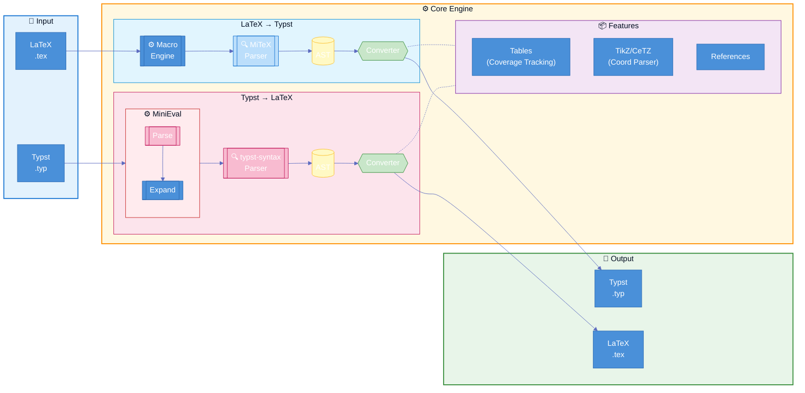

<div align="center">
  
</div>

[](https://crates.io/crates/tylax)
[](https://docs.rs/tylax)
[](LICENSE)
[](https://github.com/scipenai/tylax/actions/workflows/ci.yml)

> **双向、基于 AST 的 LaTeX ↔ Typst 转换器**

Tylax 是一个用 Rust 编写的高性能工具，可在 LaTeX 和 Typst 格式之间转换 **数学公式、表格、完整文档和 TikZ 图形**。它专注于静态分析，旨在保留文档结构以便于人工编辑调整。

## 特性

- **宏引擎**: 
  - **LaTeX**: 支持 `\newcommand`, `\def`, `\ifmmode` 以及复杂嵌套宏的完整展开。
  - **Typst**: 内置 **Typst 求值器**，在转换前处理 `#let` 绑定、`#for` 循环和条件判断。
- **双向转换**: LaTeX ↔ Typst (数学公式、文本、表格、图形)
- **高性能**: 使用 Rust 编写，可编译为 WASM 供 Web 使用。
- **表格转换**: 支持表格转换和 `multicolumn`、`multirow` 和 `booktabs`等。
- **图形转换**: 实验性支持 TikZ ↔ CeTZ 转换。
- **完整文档**: 支持章节、列表、参考文献等完整文档结构。

> **注**: 虽然 Tylax 覆盖了多数 LaTeX 和 Typst 的常用功能，但还是存在未覆盖的情况。如果您遇到转换问题，欢迎提交 [Issue](https://github.com/scipenai/tylax/issues) 并附上最小复现示例。您的反馈对改进工具有很大帮助！谢谢各位使用者！

[English](README.md) | [中文](README_CN.md)

### 🔗 [在线演示 Demo](https://convert.silkyai.cn)

---

## 安装

### 从 crates.io 安装

```bash
cargo install tylax
```

### 从源码构建

```bash
git clone https://github.com/scipenai/tylax.git
cd tylax
cargo build --release
```

---

## 使用方法

### 命令行工具 (CLI)

```bash
# 基础转换（自动检测格式）
t2l input.tex -o output.typ

# 从标准输入转换数学公式
echo '\frac{1}{2}' | t2l -d l2t

# 将 TikZ 转换为 CeTZ
t2l tikz input.tex -o output.typ
```

### Rust 库

在 `Cargo.toml` 中添加：
```toml
[dependencies]
tylax = "0.2.0"
```

```rust
use tylax::{latex_to_typst, typst_to_latex};

fn main() {
    let typst = latex_to_typst(r"\frac{1}{2} + \alpha");
    println!("{}", typst); // 输出: 1/2 + alpha
}
```

### WebAssembly (WASM)

Tylax 可编译为 WASM 以在浏览器中运行。请查看 [在线演示](https://convert.silkyai.cn) 获取实时示例，实时示例不会获取任何用户数据。

```bash
# 构建 Web 版本
wasm-pack build --target web --out-dir web/src/pkg --features wasm --no-default-features
```

---

## 设计理念

针对latex和typst场景转换做一个好用的工具。

*   **目标**: 尽可能保留原始源码结构，使输出结果易于阅读和人工编辑调整。
*   **愿景**: 致力于长期维护本项目。虽然目前侧重静态转换，但未来计划引入有限的动态求值能力，以支持更复杂的场景。

### 架构



---

## 社区

欢迎加入讨论！

<div align="center">
  <a href="https://discord.gg/veKAFnDqsw" target="_blank"></a>
  &nbsp;
  <a href="https://qun.qq.com/universal-share/share?ac=1&authKey=3CYnFQ6qWEpRzP335ZvGXL7Hli1zMu5so7KKU41Hx8syPYxGJ8MiSA9nzBpBOAK0&busi_data=eyJncm91cENvZGUiOiIxMDU3MDc4ODEwIiwidG9rZW4iOiJpb3V0b0Z4QmQzdWdlUm9DUFRvcXFtT1VqblRFcmZzV1FLZXFqcktVeUJVemJobGZONlhoQ1dxU1NXN3J5NGNrIiwidWluIjoiMTMyNjYyNzY3NyJ9&data=jiifC7VOCQf-Ta1N2Y4K1Hzq4go_jsOBTcmA9vWKDZpe6nOubOeFASLyo2qwy1z_uJK1zi0QbjZAAnVgO8Ldjg&svctype=4&tempid=h5_group_info" target="_blank"></a>
</div>

---

## 贡献

欢迎贡献！请随时提交问题和拉取请求。

1. Fork 本仓库
2. 创建功能分支 (`git checkout -b feature/amazing-feature`)
3. 提交更改 (`git commit -m 'Add amazing feature'`)
4. 推送到分支 (`git push origin feature/amazing-feature`)
5. 提交 Pull Request

### 开发指南

- 遵循 Rust 编码规范
- 为新功能添加测试
- 根据需要更新文档
- 提交前运行 `cargo fmt` 和 `cargo clippy`

---

## 许可证

本项目采用 Apache-2.0 许可证 - 详见 [LICENSE](LICENSE) 文件。

## 致谢

本项目基于以下优秀项目构建：

- [MiTeX](https://github.com/mitex-rs/mitex) - 高性能 LaTeX 解析器
- [tex2typst](https://github.com/qwinsi/tex2typst) - 符号映射参考
- [typst](https://github.com/typst/typst) - 官方 Typst 语法解析器
- [typst-hs](https://github.com/jgm/typst-hs) - 求值器的设计参考
- [Pandoc](https://github.com/jgm/pandoc) - 文档结构转换参考
